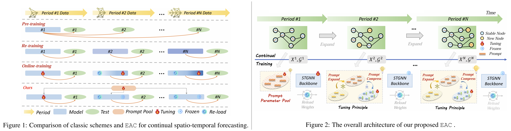

<div align="center">
  <h2><b><big>(ICLR'25) — ⏫EAC⏬</big> <br><br> <u>E</u>xpand <u>a</u>nd <u>C</u>ompress: Exploring Tuning Principles <br> for Continual Spatio-Temporal Graph Forecasting </b></h2>
</div>

<div align="center">


[](https://GitHub.com/Naereen/StrapDown.js/graphs/commit-activity)
[](http://makeapullrequest.com)

</div>

<div align="center">

> ⭐ EAC is a method for exploring the **rapid adaptation** of models in the face of open environment **dynamic spatio-temporal graph changes** during the **Supervised Finetuning Phase**.

**[<a href="https://openreview.net/pdf?id=FRzCIlkM7I">Paper Page</a>]**

By [Citymind LAB](https://citymind.top) , [HKUST(GZ)](https://www.hkust-gz.edu.cn/) .
<!-- **[<a href="#">中文解读</a>]** -->

</div>


## TODO List
- [ ] Upload the dataset to Google Drive
- [ ] Transfer the dataset to the hugging face for easy download using commands

## Updates/News:

🚩 **News** (Feb 2025): EAC's code, data, weights, and training logs are fully open source! Try to improve on this! 😊

🚩 **News** (Jan 2025): EAC has been accpeted by ICLR 2025! ✅


## 📖 Introduction

Spatio-temporal forecasting in streaming scenarios faces dual challenges: the inefficiency of retraining models over newly-arrived data and the detrimental effects of catastrophic forgetting over long-term history. 
To address these challenges, we propose a novel prompt tuning-based continuous forecasting method, EAC, following two fundamental tuning principles guided by empirical and theoretical analysis: expand and compress, which effectively resolve the aforementioned problems with lightweight tuning parameters.

<p align="center">
    
</p>


## 📚 Training Data

Our datasets are available on [Google Drive](#).

Please download all processed datasets and place them in the [data folder](./data).

We plan to place them on the hugging face for easy command download and direct use.


## 🚀 Getting Started

### Installation

1. Please install the core dependencies, including:

```shell
python = 3.8.5
pytorch = 1.7.1
torch-geometric = 1.6.3
```

2. Or you can directly create and import a ready-made environment:

```shell
conda env create -f environment.yaml
conda activate stg
```

### Usages

1. You can run a specific method on a specific dataset separately, for example, run the EAC method on the PEMS-Stream dataset:

```python
python main.py --conf conf/PEMS/eac.json --gpuid 0 --seed 43
```

2. Or you can run the script to batch execute all baseline methods on a specified dataset, for example, run all baseline methods on the PEMS-Stream dataset:

```shell
sh scripts/pems_run.sh
```

## 💴 Code repository summary

###  Summary of all model weights, logs, and configuration. 

+ **Config File**: Please refer to the [conf file](./conf) for the configuration details of different methods in different datasets. Note that all parameters follow almost the same settings.

+ **Log File**: Please refer to the [log file](./log) for the log details of different methods in different datasets. Note that the logs of different periods of a method in a data set are summarized in one file.

+ **Weight File**: Please refer to the [log file](./log) for the weight details of different methods in different datasets. Note that due to the limitation of uploaded files and size, we currently only upload one random seed weight for each experiment of each method.

### Summary of all results and observation. 

+ **Empirical Observation**: The analysis code for the observations in Figures 3 and 4 of the paper is in [empirical_observation.ipynb](empirical_observation.ipynb) file.

+ **Result Analysis**: The analysis code for the observations in Tables 1, 3 and Figures 5, 6, 7 of the paper is in [result_statistical.ipynb](empirical_observation.ipynb) file.


## Citation

> 🌟 If you find the EAC helpful in your research, please consider to star this repository and cite this [paper](https://openreview.net/pdf?id=FRzCIlkM7I):

```
@inproceedings{chen2025eac,
  title={Expand and Compress: Exploring Tuning Principles for Continual Spatio-Temporal Graph Forecasting},
  author={Wei Chen and Yuxuan Liang},
  booktitle={The Thirteenth International Conference on Learning Representations},
  year={2025}
}
```

## Acknowledgement

We appreciate the following GitHub repos or Websites a lot for their valuable code, data and efforts.

- TrafficStream [\[repo\]](https://github.com/AprLie/TrafficStream)
- STKEC [\[repo\]](https://github.com/wangbinwu13116175205/STKEC)
- Air Quality Data [\[repo\]](https://quotsoft.net/air/)
- Wind Power Data [\[repo\]](https://aistudio.baidu.com/competition/detail/152/0/introduction)


## License

This project is licensed under the Apache-2.0 License.
